# MiWi RN Command Parser
MiWi RN command parser are demos created and modified from SAMR30 and SAMR21 MiWi example code generated from Microchip Studio ASF. Based on ASF example code, MiWi RN command parser provides a set of RN command interface for host unit (MCU or PC terminal) to control and read from MiWi unit (SAMR30 or SAMR21 with MiWi firmware). RN commands use UART as physical communication interface.

The package includes below folders:

SAMR30_RN_command folder includes MiWi RN command parser projects for MiWi Star and MiWi P2P, and their independent projects for SAMR30 XPro board and SAMR30 Module XPro board, as well as prebuilt hex files for Star/P2P on these two boards.

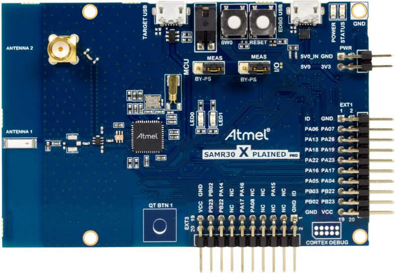

SAMR30 XPro board

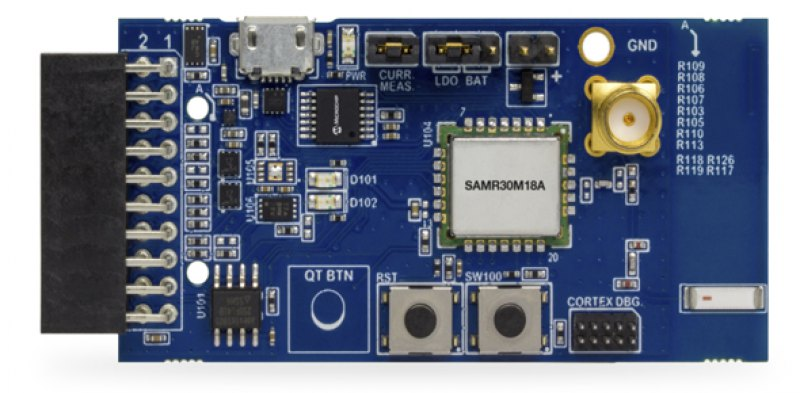

SAMR30 Module XPro board

SAMR21_RN command folder includes MiWi RN command parser projects for MiWi Star and MiWi P2P on SAMR21 Xpro board.

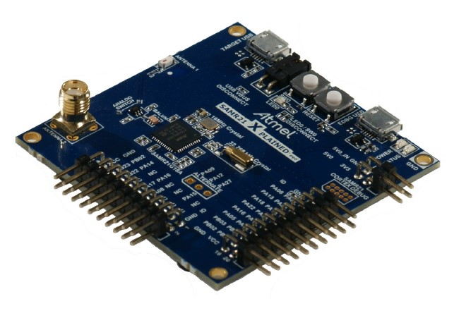

SAMR21 Xpro board

# About the Code and Porting Code to Other Hardware

All the modified code are included by macro MIWI_RN_CMD, this provide the convenience if user want to port RN command to their own MiWi project, and it keeps the same style as MiWi example projects of ASF, such as it provides independent project for SOC SAMR30 or SAMR21, and their different hardware board, independent projects for P2P and Star, with this source code release, user can feel free to know RN command parser implementation and add more command or functions based on current projects.

MiWi RN command parser major implementations are in the file **rn_cmd.c** and **rn_cmd.h**.

# UART Configuration

RN command uses UART as physical communication channel, UART configuration is baudrate 115200bps, 8bit, no parity, and 1 stop bit. There is no flow control.

# RN Command Format

To make RN command readable, all field of one command are just ASCII strings. And command sent  from host unit to MiWi unit are ended by character ‘\r’, which hexadecimal value is 0x0D. MiWi unit  will detect ‘/r’ as the end of one complete command sent by host unit. Likewise, host unit also need to detect ‘/r’ as the end of one complete command returned by MiWi unit.

# Configure Mode and Action Mode

MiWi RN command defines two command mode applied for its communication protocol. First is Configure Mode. In this mode, user can use the command to configure MiWi protocol level behaviors like channel, PAN ID. Usually these commands are started with tag “cfg” followed by some other parameters.

If receives command “~cfg”, MiWi unit will exit from Configure Mode and enter Action Mode.

Those command started with “cfg” can only be accepted in Confgure mode, and it will be rejected in Action Mode.

Similarly, those command meaning MiWi action can only be accepted in Action mode and will be rejected in Configure mode.

Only a few commands which don’t make configuration or start action will be allowed in both Configure mode and Action mode.

After MiWi unit exit from Configure Mode, it will stay at Action Mode. There is no way to enter Configure mode again except for a reset.

# Reboot

After MiWi unit is hardware or software reset, it will return a “Reboot” to host, host can only send command after “Reboot” is received.

# Enable and Disable Echo

If host is MCU, then don’t need to enable echo.

But if host is a PC terminal, using type-in characters to control MiWi, it is better that user types in “echo” to enable echo mode. Under echo mode, any character user input will be echoed back in PC terminal and displayed out, so user can clearly know what he has inputted.

# Acknowledgement

As communication protocol, for any command sent by host, there will be acknowledgement returned to host. Acknowledgement can be either AOK or ERR, or information returned because of command execution. Host must wait for its acknowledgement before it sends another command. For details about acknowledgement or returns for each command, please refer to Command Details.

# Build and Run the Demos

Giving example on building demo on SAMR21 Xpro board, first program SAMR21 Xpro board by either P2P or Star firmware, the demo package provides source code to build hex file as well as provides prebuilt hex files.

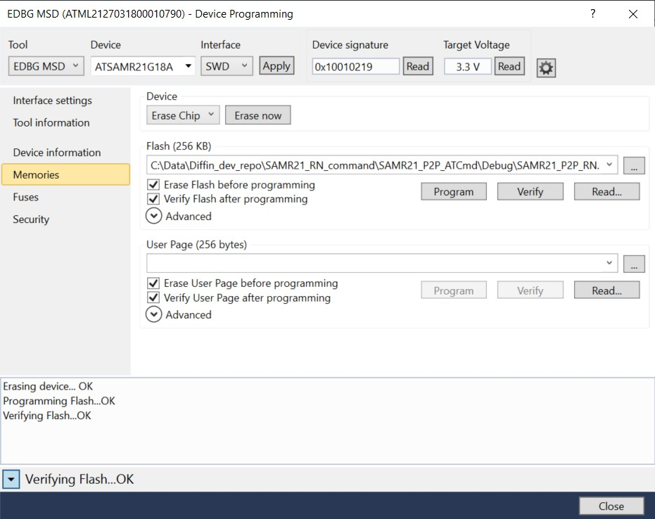

Connect board to PC, open Tera Term, and configure UART as followings. Configure all of boards used in the demo.

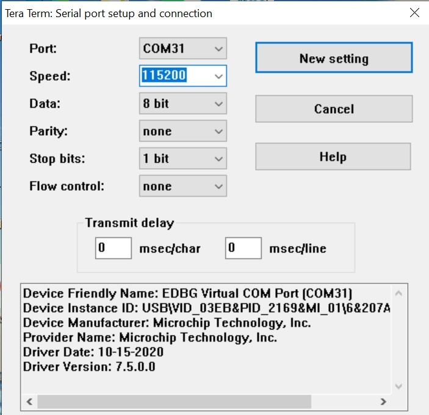

Then press RESET button on all board, will see “Reboot” from Tera Term. Then type in “echo” on all Tera Term, to enable echo mode for all board, this is to give display back on user’s input. After the “echo” is received and echo mode is enabled, will see “AOK” in Tera Term.

# Running P2P Demo

For P2P demo, will at least need 2 board. After echo mode is enabled on two boards, referring to below running example, type-in these commands to see the output and operation.

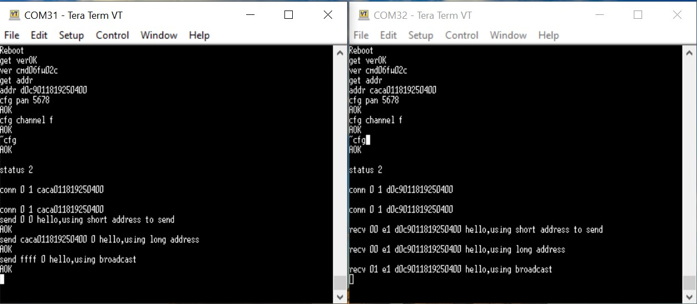

In above example, below command are typed-in during the operation:

echo

get ver

get addr

cfg pan 5678

cfg channel f

~cfg

send 0 0 hello,using short address to send

Send caca011819250400 0 hello,using long address

send ffff 0 hello,using broadcast

During the demo, after one board is typed-in “send” command, on another board, will see “recv” command and its contents showed by Tera Term. 

# Running Star Demo

For Star demo, suggest using 3 board, 1 will be the PAN device, and other 2 will be end devices. In the same way, program these board, open their Tera Term and configure their UART, press RESET button on each board, wait to see “Reboot”, and then type-in “echo” to enable echo mode for each board. Then referring to below running example, type-in these commands and see the operation and output.

At PAN device,

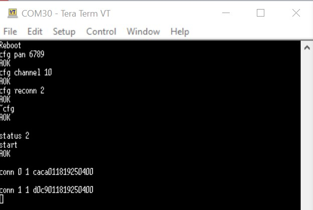

At two end devices, 

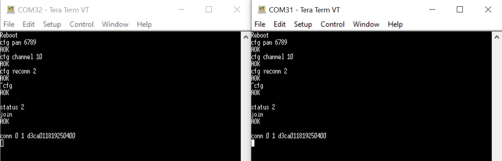

These commands are used during the Star network creation:

cfg reconn 2

start

join

In this example, manual creating Star network is used, thus configure “recon” to setting 2, thus after exiting from configure mode, used “start” and “join” command to manual specify PAN and end device.

Then we can use command to do communication between PAN and end devices, as well as communication between end devices.

At PAN device, data between PAN and end devices:

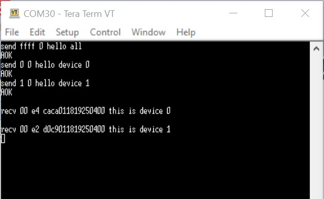

At two end devices, data between PAN and end devices:

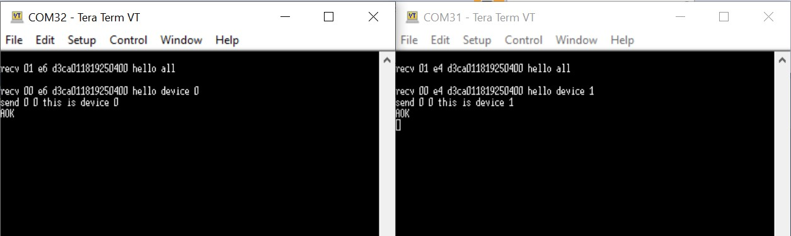

At two end devices, data sent from end device 1 to end device 0:

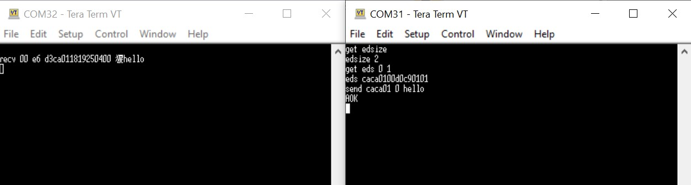

# RN Command Details

All the command details are described in another document [MiWi RN command set manual](rncmd.md)

