# MIWI RN Command Set Manual

## 1 INTRODUCTION

This document is to describe MiWi  RN command set, which is in flat ASCII code format.

This command set is designed only for MiWi P2P or MiWi Star protocol, MiWi mesh is not supported by this command set.

The purpose of RN command is to provide simple and readable command controlling and returning for host unit, the host unit can be a host MCU or PC terminal.

If user uses PC terminal to talk with MiWi unit by RN command set, send command “echo” to enable echo, it will get his input echo back, this will be good for user to know his input.

If user uses host MCU to control MiWi unit by RN command set, don’t enable echo, as this will add extra cost for MCU to decoding data.

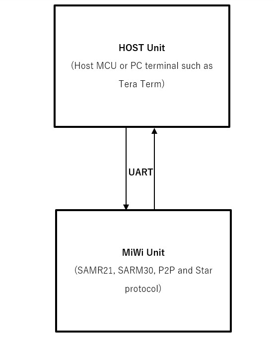

## 2 PROTOCOL BASIC

### UART Configuration

Commands use UART as communication channel, UART configuration is baudrate 115200bps, 8bit, no parity, and 1 stop bit. There is no flow control.

### Command Format
To make command readable, all field of one command are just ASCII characters.
And commands both sent from host unit and returned to host are ended by character ‘\r’, which hexadecimal value is 0x0D. MiWi will detect ‘/r’ as the end of one complete command sent by host. Likewise, host also need to detect ‘/r’ as the end of one complete command returned by MiWi unit.

### Configure Mode and Action Mode
Here it is defined two command mode applied for this communication protocol. First is Configure Mode. In this mode, user can use the command to configure MiWi protocol level behaviors like channel, PAN ID. Usually these commands are started with tag “cfg” and followed by some other parameters.

When command “~cfg” is received, MiWi unit will exit from Configure Mode and enter Action Mode.

Those command started with “cfg” can only be accepted in Configure mode, and it will be rejected in Action Mode.

Similarly, those command meaning MiWi action can only be accepted in Action mode and will be rejected in Configure mode.

Only a few commands which don’t make configuration or start action will be allowed in both Configure mode and Action mode.

After MiWi unit exit from Configure Mode, it will stay at Action Mode. There is no way to enter Configure mode again except for a reset.

### Reboot
After MiWi unit is hardware or software reset, it will return a “Reboot” to host, host can only send command after “Reboot” is received.

### Echo
If host is an MCU, then don’t need to enable echo.

But if host is a PC terminal, such as Tera Term, using type-in characters to control MiWi, it is better that user type-in “echo” to enable echo mode. Under echo mode, any character user input will be echoed back in PC terminal and displayed out, so user can clearly know what he has inputted.

### Acknowledgement
As communication protocol, for any command sent by host, there will be acknowledgement returned to host. Acknowledgement can be either AOK or ERR, or simply immediate information required by the command, however there is only one command sent by MiWi. As a result, therefore, host must wait for its acknowledgement before it sends another command.

## 3 COMMAND LIST
### Commands Host unit send to MiWi unit:

> echo

> ~echo

> cfg reconn r1

> cfg pan r1

> cfg channel r1

> cfg phymod r1

> cfg txpower r1

> ~cfg

> get ver

> get addr

> get channel

> get pan

> get role

> get consize

> get conn r1

> get edsize

> get myindex

> get eds r1 r2

> start

> join

> remove r1

> send r1 r2 r3

> reset

### Commands MiWi unit report to host unit:
> AOK

> ERR

> Reboot

> ver r1

> addr r1

> channel r1

> pan r1

> role r1

> consize r1

> conn r1 r2 r3

> recv r1 r2 r3 r4

> status r1

> error r1

## 4 COMMAND DETAILS

### echo
Enable echo mode, in this mode, MiWi unit echo back what ASCII characters it gets from host unit. Send command to enable echo when using PC terminal to control, and don’t send command to enable echo if using host MCU to control.

In default, echo mode is disabled.

> *Example:*	echo

> *Response:*	AOK

### ~echo
Disable echo mode.

> *Example:*	~echo

> *Response:*	AOK

### cfg reconn r1
Configure reconnection behavior. This command is only accepted in Configure mode.

r1: 8bits hex value, in range of 0~2, representing the reconnection behavior after system is rebooted, as shown in below table:

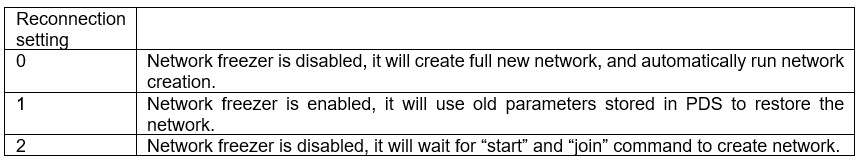

> *Example:* 	cfg reconn 0	//create new network, and firmware run network creation automatically.

> *Response:*	AOK

> *Response:*	ERR

### cfg pan r1
Configure PAN ID for the MiWi network. This command is only accepted in Configure mode.

r1: 16bits hex value , representing the PAND ID to be configured.

Default value is 0x1234.

> *Example:* 	cfg pan 7890	//configure PAND ID to 0x7890

> *Response:*	AOK

> *Response:*	ERR

PAN ID will be stored into PDS, and can be used for network restore at next time restart

### cfg channel r1
Configure channel number for the MiWi network. This command is only accepted in Configure mode.

r1: 8bits hex value, representing the channel number to be configured. Valid value is in the range of 0 to 26. Otherwise it will report ERR.

Default value is channel 8 for SAMR30 devices, and channel 26 for SAMR21 devices.

> *Example:* 	cfg channel 6	//configure to channel 6

> *Response:*	AOK

> *Response:*	ERR

**Notes** about channel and band frequency supported in this firmware:

For SAMR21, only band 0 is supported by this firmware, and this band comply with IEEE 802.15.4. In this band, channel 0x0B to channel 0x1A can be selected, these channels are described in below table:

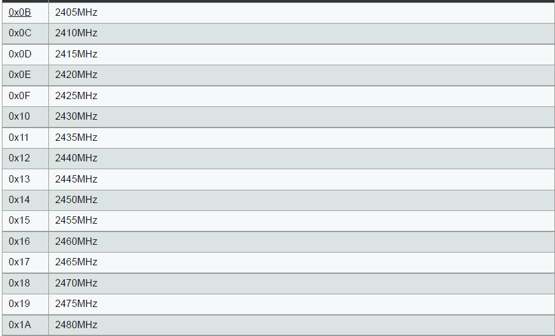

For SAMR30, also only band 0 is supported by this firmware, this band comply with IEEE 802.15.4, 868.3MHZ of EU band, and 906MHZ to 924MHZ of North American band. Below table describes the details:

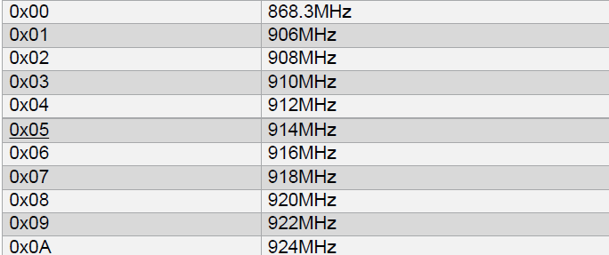

Channel number will be stored into PDS and can be used for network restore at next time restart.

### cfg phymod r1
Configure PHY modulation for SAMR30 or SAMR21. This command is only accepted in Configure mode.

r1: 8bits hex value, while least 5bits will be accepted. 

For SAMR30, this value will be set into register TRX_CTRL_2, bit5 OQPSK_SCRAM_EN, bit4 ALT_SPECTRUM, bit3 BPSK_OQPSK, bit2 SUB_MODE, bit1~0 OQPSK_DATA_RATE. Values in below table will be accepted, otherwise it will report ERR.

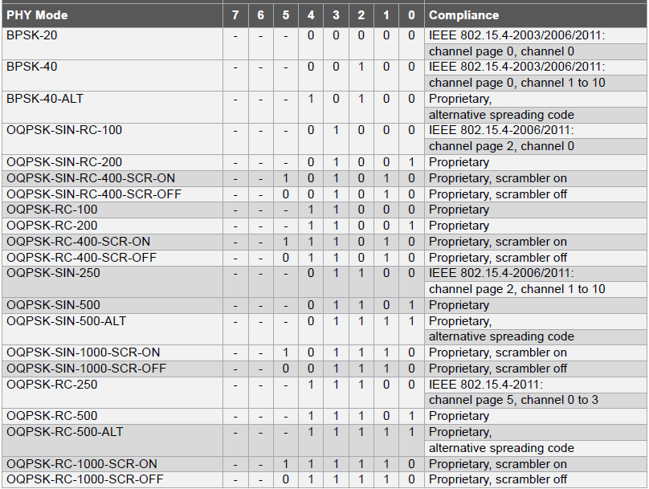

When configure PHY modulation, need to consider channel number setting altogether.

For SAMR21, this value is used to set register TRX_CTRL_2, bit2~0 OQPSK_DATA_RATE. Value only from 0 ~ 3 are accepted, other value will get ERR response. 

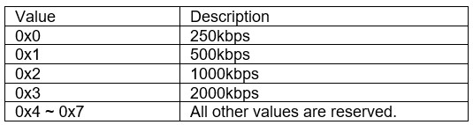

Default setting is BPSK-20 for channel 0 and BPSK-40-ALT for other channel for SAMR30, or 250kbps for SAMR21.

> *Example:* 	cfg phymod 4	//configure to BPSK-40 for SAMR30, 40kbps, BPSK modulation.

> *Response:*	AOK

> *Response:*	ERR

> *Example:* 	cfg phymod 3	//configure to 2000kbps for SAMR21

> *Response:*	AOK

> *Response:*	ERR

**PHY modulation or data rate setting will not be stored into PDS, user need to configure them every time when system restarts.

### cfg txpower r1
Configure PHY transmitter power for SAMR30 or SAMR21. This command is only accepted in Configure mode.

r1: 8bits hex value.

For SAMR30, firmware will not check the value is proper or not, while user need to set the correct value according to table below.

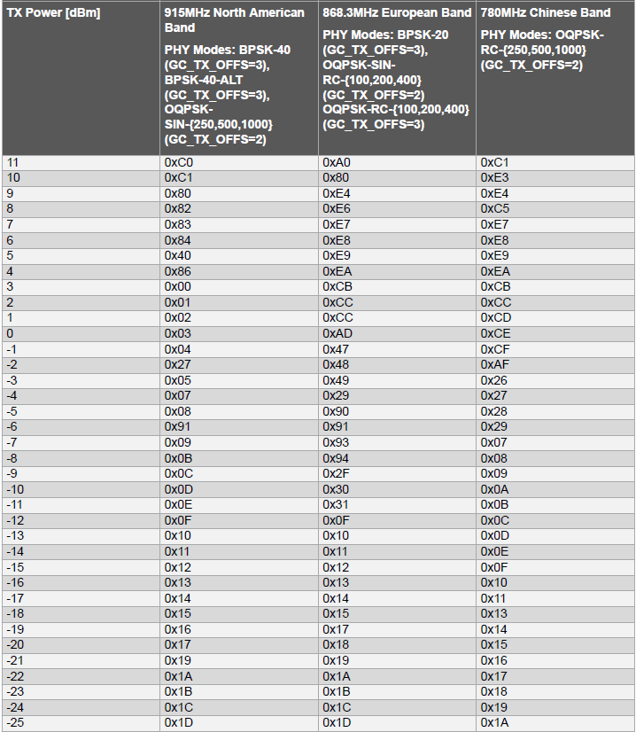

The firmware will configure GC_TX_OFFS, no need user to configure it.

For SAMR21, firmware only accept value in 0x0~0xf, means power from +4dbm to -17dbm, referring to below table. For other values input, it will report ERR.

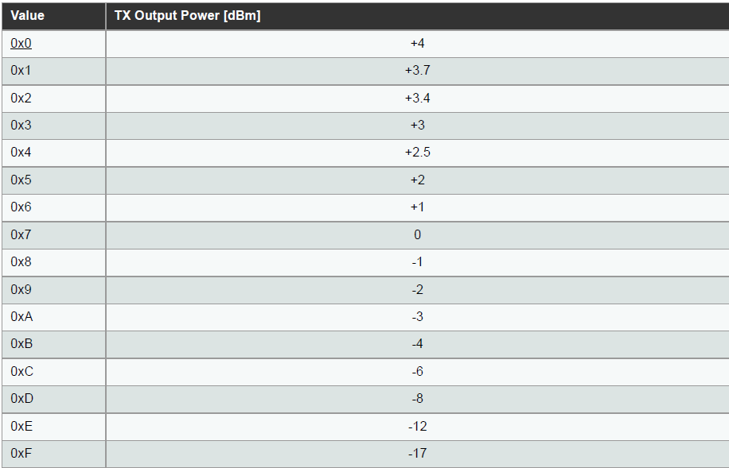

Default setting is +3dbm for SAMR30, and +4dbm for SAMR21.

> *Example:* 	cfg txpower 3	//configure to +3dbm for SAMR21

> *Response:*	AOK

> *Response:*	ERR

** PHY modulation or data rate setting will not be stored into PDS, user need to configure them every time when system restarts.

### ~cfg
Exit from Configure mode, thus it will enter Action mode.

If reconnection setting is 0 or 1, it will automatically create or restore MiWi network, will not wait for user command “start” or join.

> *Example:* 	~cfg

> *Response:*	AOK

### get ver
This command is to get firmware version. Firmware version will be returned as format such like “cmd01fw01a”. In this example, it means command version is 01 and firmware version is 01a. For the firmware version, the last character represents MiWi protocol, ‘a’ means SAMR30 P2P protocol firmware, ‘b’ means SAMR30 Star protocol firmware, ‘c’ means SAMR21 P2P protocol firmware, ‘d’ means SAMR21 Star protocol firmware.

Return format: ver r1

> *Example:* 	get ver

> *Response:*	ver cmd01fw01a	//command version 01, firmware version 01a

### get addr

This command is to get device its own 64bits IEEE long address. 

Return format: addr r1

> *Example:* 	get addr

> *Response:*	addr b42aafd993ba01485	//device own address is 0xb42aafd993ba01485

### get channel

This command is to get channel number configured for MiWi. The channel returned is an 8bit hex value, in range of 0 to 26.

Return format: channel r1

Default channel number is 8 for SAMR30 device and 26 for SAMR21. 

> *Example:* 	get channel

> *Response:*	channel 6	//return channel = 6

### get pan
This command is to get PAND ID configured for MiWi. The PAND ID returned is a 16bits hex value.

Return format: pan r1

Default PAND ID is 0x1234. 

> *Example:* 	get pan

> *Response:*	pan 1234	//return PAN ID = 0x1234

### get role
This command is to get role of this device in the MiWi network. This command is only accepted in Action mode.

Return is 2bits value. Bit 0 means who started the network, bit 1 means who is the PAN. Bit0 is only valid for P2P firmware, bit 1 is only valid in Star protocol. Details is shown below:

Bit 0:	0: joining network			1: starting network

Bit 1: 	0: end device in Star network	1: PAN coordinator in Star network.

Return format: role r1

> *Example:* 	get role

> *Response:*	role 01	//this device is the first device, who is starting the network.

### get consize
This command is to get total of connection or saying how many devices are connected. This command is only accepted in Action mode.

Returned is hex value, representing how many devices is connected.

Return format: consize r1

Use this command to get total of connection before using get conn r1 command to get connection detailed information.

> *Example:* 	get consize

> *Response:*	consize 01	//1 peer device is connected.

### get conn r1
This command is to get the connection status and peer device 64bits IEEE long address. This command is only accepted in Action mode.

r1 is index of connection. This index number cannot be equal to or greater than the total connections returned by get consize command.

Return format: conn r1 r2 r3

r1 is the index of connection, it is equal to r1 of get command get conn r1

r2 is a boolean value. True means the connection is valid, false means the connection is invalid.

r3 is 64bits hex value representing peer device long address.

> *Example:* 	get conn 0

> *Response:*	conn 01	9fc65cf9e2450591 //the connection is valid, and peer device long address is 0x9fc65cf9e2450591.

**Note that whenever connection table is changed, MiWi unit will initiatively send conn r1 r2 r3 to host unit, ever there is no get conn r1 command sent.

### get edsize
This command is to get total of end device table, which is periodically shared by PAN device. This command is only for MiWi Star end device, not available for PAN device of Star or P2P all devices. This command is only accepted in Action mode.

Returned is hex value, representing how many end devices is in the Star network, note that this number includes the device itself. 

Return format: edsize r1

Before using get eds r1 r2 command to get end devices table information, need to use get edsize to get total of end device first.

Example: 	get edsize

Response:	edsize 2	//two end device is in the network, including the device itself.

### get myindex
This command is to get index number of itself in end device table which is maintained by PAN. This command is only accepted for end device of Star, not available for PAN device of Star or P2P. The device itself is an end device in current Star network, get edsize command will also count itself, therefore, usually need to use get myindex to identify the index number belonging to itself. If host MCU want to send command to others by index, it will not send command to itself. This command is only accepted in Action mode.

Returned is hex value, representing index number of itself in current Star network.

Return format: myindex r1

Example: 	get myindex

Response:	myindex 1	//index of itself is 1, index is starting from 0

### get eds r1 r2
This command is to get end device table information, which is shared by its PAN device. This command is only for end device of Star, not available for PAN device of Star or P2P. This command is only accepted in Action mode.

r1 is the start index, device table information will be read and returned starting from this index.

r2 is the end index, device table information will be read and returned ending by this index.

Return format: eds r1

r1 is composed of a number of end device information unit, start from specified starting index and end by specified ending index. Every information unit is composed by 4 bytes, it has this format as this aabbccdd, in which aabbcc is the higher 3 bytes of target end device’s 8bytes of IEEE long address, dd is the index number in the end device table.

aabbcc 3 bytes of address will be used in send command for end device X sending data to end device Y.

Example: 	get eds 0 1

Response:	eds 45e680001be68001	//includes two end device information. First end device has index 00, it has 3bytes higher address 0x45e680. Second end device has index 01, it has 3bytes higher address 1be680.

Note that in above Response example, all 8bytes of IEEE address of two example end are 0x45e680feff629106 and 0x1be680feff629106

### start
This command is to call MiAPP API to start MiWi network. In Star protocol, who starts the network, he will be the PAN device of Star network, and other devices will join his network as end devices. This command is only accepted in Action mode.

> *Example:* 	start

> *Response:*	AOK

> *Response:*	ERR

### join
This command is to call MiAPP API to establish network, which means join a exist network. In Star protocol, this device will be end device. This command is only accepted in Action mode.

> *Example:* 	join

> *Response:*	AOK

> *Response:*	ERR

### remove r1
This command is to call MiAPP API to remove one connection in the network. This command is only accepted in Action mode.

r1 is index of connection. This index number cannot be equal to or greater than the total connections returned by get consize command.

> *Example:* 	remove 0	//remove connection with index = 0

> *Response:*	AOK

> *Response:*	ERR

### send r1 r2 r3
This command is to send transparent data to peer device. This command is only accepted in Action mode. It has many kinds of usage depending on r1 and r2 format or length.

r1: it can be a connection index value, or 0xffff as broadcast address, or 8bytes of IEEE long, or first 3bytes of IEEE long address in ED X to ED Y transmission mode.

If r1 is index value, it should be small than total connection number received by command get consize. In this case, data transmission type is unicast.

If r1 is “ffff” or “FFFF”, it will broadcast data to all other devices which has same PAND ID and channel etc setting.

If r1 is a 64bits hex value, it means data is transmitted to the device who has IEEE long address as this 64bits hex value. Data transmission type is unicast.

Send command also support data transmission from end device X to end device Y, which means the sender is end device in a Star network. In this transmission type, r1 is the first 3 bytes of end device Y’s IEEE long address. It’s first 3 bytes can be obtainied by get eds r1 r2 command 

r2: it can be 0 or other non-zero value.

If r2 is 0, firmware will auto count the actual size of r3 string and send data out.

If r2 is non-zero, firmware will only send r2 size of data.

r3: the data to be sent out. With default code, r3 as user data has length limitation. Below shows user data length in 3 different transmission type:

For broadcast type, user data length limitation is 56 bytes, excluding ‘r’ character at command tail.

For PAN unicast to end devices, user data length limitation is 51 bytes, excluding ‘r’ character at command tail.

For end device X sending data to end device Y under Star network, user data length limitation is 47 bytes, excluding ‘r’ at command tail.

> *Example:* 	send 0 0 hello	//unicast send “hello” string to device whose connection index = 0

> *Response:*	AOK

> *Response:*	ERR

> *Example:* 	send 0 5 hello	/unicast send 5bytes of “hello” string, to device whose connection index = 0

> *Response:*	AOK

> *Response:*	ERR

> *Example:* 	send b42aafd993ba0148 0 hello	//unicast send “hello” string to device whose long address = b42aafd993ba0148

> *Response:*	AOK

> *Response:*	ERR

> *Example:* 	send ffff 0 hello	//broadcast send “hello” string to all connected device

> *Response:*	AOK

> *Response:*	ERR

> *Example:* 	send 45e680 0 hello	//end device X send data to end device Y, “45e680” is the first 3 bytes of end device Y’s long address, which is gotten from get eds r1 r2 command

> *Response:*	AOK

> *Response:*	ERR

### recv r1 r2 r3 r4
When a MiWi device receives any data from other MiWi device, it reports received data to host by this command. Other than received data, relative information including data security, broadcast type or unicast type, RSSI value, source address will also be reported by this command.

r1: 2bits hex value, representing data type shown in below table.

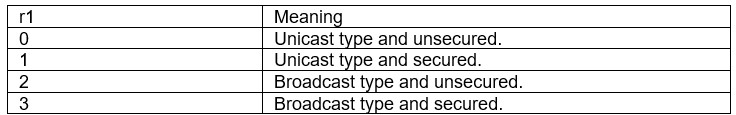

r2: 8bits hex value representing RSS value.

r3: 64bits hex value representing source device’s 8bytes IEEE long address. For unicast from PAN or broadcast, r3 simply means the source device’s address. However, for data receiving type that end device X sending data to end device Y, r3 doesn’t represent end device’s Y’s address, but represents its PAN’s address, because this case is forwarded from PAN.

r4: received data. For unicast from PAN or broadcast, r4 simply represents full data input at peer device’s send command. However, for data receiving type that end device X sending data to end device Y, r4 doesn’t purely represents user data which is input at send command. Under this receiving type, first 3 bytes of r4 represents first 3 bytes of end device X’s IEEE long address.

Note that there is no connection index or received data size reported.

This command is initiated by MiWi unit.

> *Example:* 	recv 00 c4 b42aafd993ba01485 hello  //received unicast&unsecured data, RSSI = 0xb4, source device address = 0x b42aafd993ba01485, data received is “hello”

### status r1
This command is for MiWi unit reporting some typical status change to host unit. 

r1: below table shows r1 value and its representation.

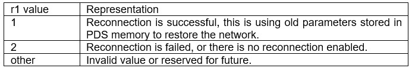

> *Example:* 	status 2	//no reconnection is enabled.

### error r1
This command is for MiWi unit reporting some error code to host unit. 

r1: below is the table which shows r1 value and its representation, however, not all of values will be used, only several value is reported under certain situation, these situation majorly includes data transmission and start/join a network.

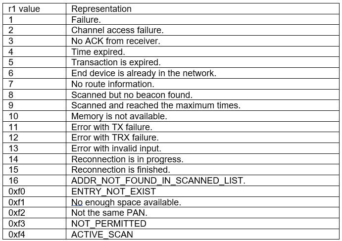

> *Example:* 	error 1	//failed to join any network

### reset
This command will erase PDS memory of SAMR30 or SAMR21, therefore those network parameters stored previously will be full erased. Next time after system is restarted, need to create full new network.

> *Example:* 	reset

> *Response:*	AOK

### Reboot
When system is restarted, firmware will first do some initialization work. After that, MiWi unit will report “Reboot” to host. Host only can send command after “Reboot” is received. 

Considering having a good display using Tera Term as PC terminal, a character ‘/r’ is attached after “Reboot” string.

### AOK
MiWi unit use this command to acknowledge any command sent by host, and it means the command sent by host is acceptable or executable.

### ERR
MiWi unit use this command to acknowledge any command sent by host, and it means the command sent by host is not proper, maybe because of wrong command name or wrong parameter.

